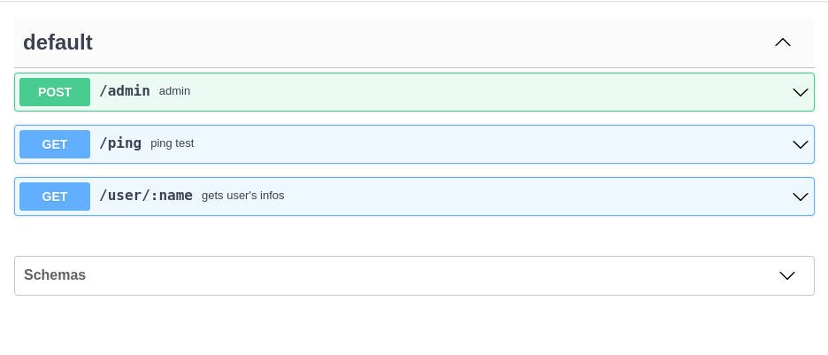
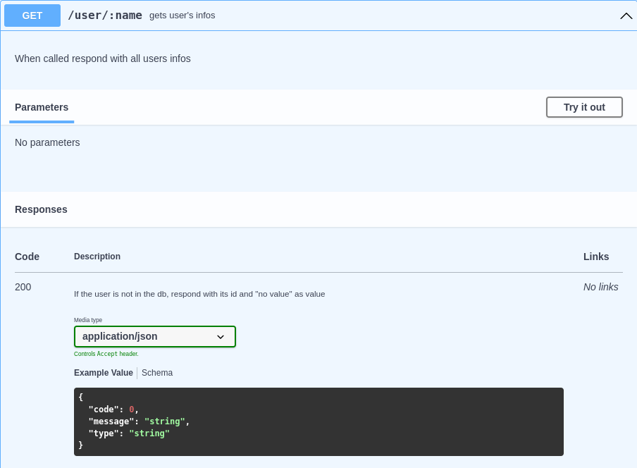

# GinGen

Nowadays, in order to make developers' tasks easier, numerous tools of all kinds have been invented. This is particularly true for anything related to code documentation, as it is a crucial part for ensuring that every team member can quickly understand how each part works.

Regarding APIs, a documentation system called [Swagger UI](https://swagger.io/tools/swagger-ui/) has been implemented to facilitate the understanding of each endpoint and their different bodies and responses. But in order to generate this documentation, Swagger requires a JSON document with different fields to correctly transcribe the information, known as an [OpenAPI specification](https://swagger.io/specification/).
This specification is integrated in a whole ecosystem of tools available to create tests, stubs and simplify development processes ⚙️

To generate this JSON specification, many people would find it simpler and more natural to simply document each function directly in the code, so that it can be used to create a specification incrementally and simplify its maintenance. 

This is where the idea for **GinGen** came about, an program that allows for a specific documentation present in a **Go code** to be transcribed into a valid OpenAPI v3 specification that can be used with the tools provided by **Swagger** and the OpenAPI community 🚀

<br>


<br>
<br>

**Here is how the result of the code present in the demo file would look like:**


**With each containing its own informations:**


## How does it work?

This project focuses on two important parts of an API:
- **Endpoints**, which are the different triggers that are called when a specific URL is executed.
- **Handlers**, which are the methods called following the call of an endpoint.

Therefore, there are two types of documentation to look for.

For now, we are parsing only one file at a time, but we plan to dive deeper by allowing the program to be launched at the root of an API in order to retrieve each part of the documentation.

## Getting Started

### Installation

Clone the repository and simply execute:
```sh
make
```

to build the `GinGen` executable.

### Usage

To run the program, two arguments are required:
- the file to parse
- the JSON file in which to write the result.

```sh
./GinGen -i main.go -o doc.json

# Alternative option with the full flags
./GinGen --input main.go --output doc.json
```

You can also specify a JSON file containing components to be added to the generated specification using the `-c` or `--component` flag.

____________________

There are two types of documentation to provide:
- one for each Endpoints
- one for each Handlers

**Let's start with the Endpoints**

We will take for exemple this endpoint:

```r.GET("/ping", ping)```

To document an Endpoint properly we need to start and end its documentation with:
```//@EndPointDeclaration_Start```
```//@EndPointDeclaration_End```

Which gives us:

```
//@EndPointDeclaration_Start
//@EndPointDeclaration_End
r.GET("/ping", ping)
```

Now let's provide it with all the information that are required. Which are:
- The Method
- The Path
- The HandlerId (the handler that the endpoint is linked to)
- The Summary
- The Description

So the final result is:

```
//@EndPointDeclaration_Start
//@Method: GET
//@Path: /ping
//@HandlerId: main.ping
//@Summary: ping test
//@Description: when pinged respond pong
//@EndPointDeclaration_end

r.GET("/ping", ping)
```  

<br>

**Now, about the Handlers**

We will take for exemple this handler:

```
func admin(c *gin.Context) {
	user := c.MustGet(gin.AuthUserKey).(string)
	// Parse JSON
	var json struct {
		Value string `json:"value" binding:"required"`
	}
	if c.Bind(&json) == nil {
		db[user] = json.Value
		c.JSON(http.StatusOK, gin.H{"status": "ok"})
	}
}
```

To document an Handker properly we need to start and end its documentation with:
```//@HandlerDeclaration_Start```
```//@HandlerDeclaration_End```

Now we need to get to the more complicated part, the information.
Unlike the Enpoints which all contain the same details to provide, handlers can require multiple types of **Bodies** and **Responses**. As a result you can specidy as many bodies and responses as you want.

**Bodies** require:
- A Description
- Types
- A Schema
- if it is required

**Responses** require:
- A Status
- A Description
- Types
- A Schema

So the final result is:
```
//@HandlerDeclaration_Start

//@HandlerId: main.admin
//@RequestBody
//@-Description: a good description
//@-Types: application/json
//@-Schema: #/components/schemas/User
//@-required: true
//@Response
//@-Status: 200
//@-Description: update the db with the given user id, and respond "ok"
//@-Types: application/json
//@-Schema: #/components/schemas/ApiResponse

//@HandlerDeclaration_End
func admin(c *gin.Context) {
	user := c.MustGet(gin.AuthUserKey).(string)
	// Parse JSON
	var json struct {
		Value string `json:"value" binding:"required"`
	}
	if c.Bind(&json) == nil {
		db[user] = json.Value
		c.JSON(http.StatusOK, gin.H{"status": "ok"})
	}
}
```

## Get involved

You're invited to join this project ! Check out the [contributing guide](./CONTRIBUTING.md).

If you're interested in how the project is organized at a higher level, please contact the current project manager.

## Our PoC team :heart:

Developers
| [<br><sub>Victor Massonnat</sub>](https://github.com/VidsSkids) | [<br><sub>Timothée De Boynes</sub>](https://github.com/TdeBoynes)
| :---: | :---: |

Manager
| [<br><sub>Reza Rahemtola</sub>](https://github.com/RezaRahemtola)
| :---: |

<h2 align=center>
Organization
</h2>

<p align='center'>
    <a href="https://www.linkedin.com/company/pocinnovation/mycompany/">
        
    </a>
    <a href="https://www.instagram.com/pocinnovation/">
        
    </a>
    <a href="https://twitter.com/PoCInnovation">
        
    </a>
    <a href="https://discord.com/invite/Yqq2ADGDS7">
        
    </a>
</p>
<p align=center>
    <a href="https://www.poc-innovation.fr/">
        
    </a>
</p>

> 🚀 Don't hesitate to follow us on our different networks, and put a star 🌟 on `PoC's` repositories

> Made with ❤️ by PoC
